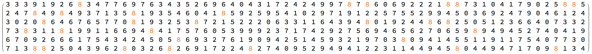
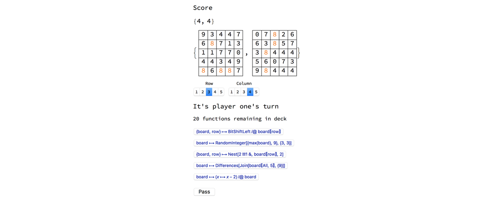
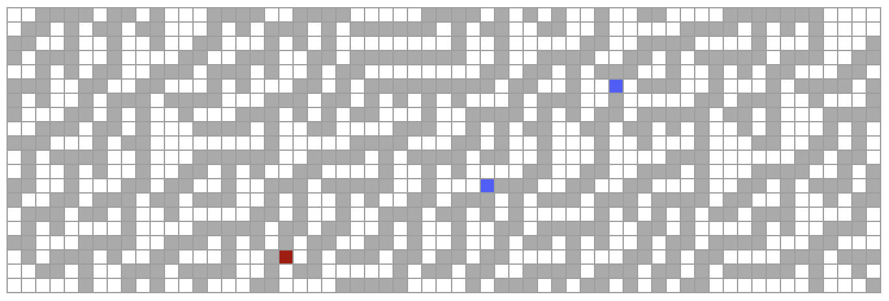
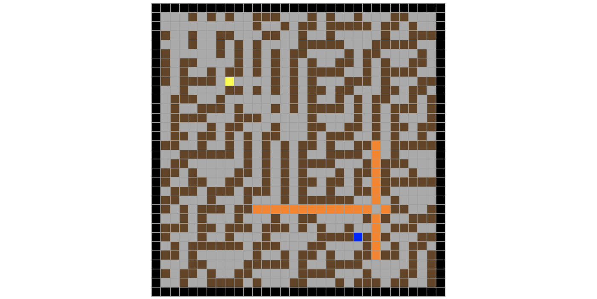

# Pure Functional Games

## Overview

This project involves designing and implementing games in Mathematica by examining classical games for inspiration and employing pure functions and combinators. Pure functions will be used to allow players to alter the state of the game in order achieve a specified objective, and combinators will be studied as their properties may be useful to extend the depth and strategy of the games.

Classical card games and board games often involve a combination of random elements and also a way for players to influence their performance by employing strategy. This project will mimic those characteristics and adjust them as necessary to create various games.

An example of a game based on pure functions may operate roughly as follows. The game board is represented by a graph and begins with a single vertex. The vertex represents an argument to a function. Each player holds in their hand a list of functions, which they apply to the verticies of the graph to effect the game. When a function from a player's hand is applied to a vertex the result is placed on the board as a new vertex and an edge is drawn between the two verticies. The goal of the game is to be the last one to make a move such that the next player is unable to find a vertex containing a valid argument to any of the functions they hold in their hand. 

## Games

Three different types of games were created for this project. A functional game where each player applies pure functions to their grid in order to create as many eights as they can before the deck runs out. A interactive visualization where the player must use turing machine style options in order to surf on cellular automata with the goal of collecting blue gems. And lastly, a clone of bomberman where the playing field is rule 30.

### GreatEights

Each player has a five by five grid of numbers mod 10. Taking turns, players choose a pure function from the five open functions on the table. This function is then applied to their matrix, and the resulting number of eights becomes their current score. When a player uses a function that function is removed and another is drawn from the deck. The game ends when their are no more functions. The winner is the player with the most eights.  

### CellularSurfer

The user can adjust the rule number, which they want to surf on, and they can adjust the actions that their surfer takes based on the three cells infrot of them. The user then surfs over the cellular automata attempting to collect blue squares. The players score is the number of blue squares they collect.

### BomberMan

Players use keyboard keys to navigate around a grid attempting to place bombs in each others path. The walls of the grid and the players can be destroyed by explosives. The game ends when one a player gets hit by the path of an explosive.    

This project is part of the 2017 Wolfram Summer School.
